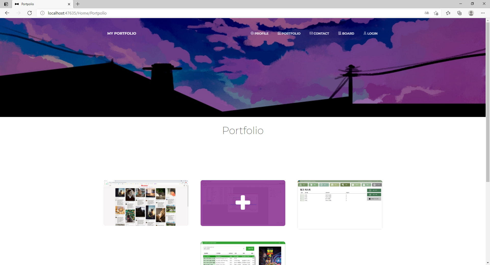

# StudyAspNet21
- [ASP.NET 학습](#aspnet)
- [ASP.NET CORE MVC 웹](#aspnet-core-mvc-웹)
-------

## ASP.NET

- <h3>asp.net 주요 내장 개체</h3>

    - Response
        : 서버에서 클라이언트로 결과 전송 
        - Redirect() : 지정된 페이지로 이동
      
    - Request
        : 사용자에게 값을 요청
        - QueryString[] : Get 방식
        - Form[] : Post 방식
        - Params[] : Get/Post 방식 모두 받음
    - Server
    - Application
    - Session

- <h3>컨트롤</h3>

    - runat="server"

    - Linkbutton & Hyperlink
        - Linkbutton은 C#에서 redirect
        - Hyperlink는 asp에서 바로 navigateurl

    - Fileupload
    - Substitution
    - Localize

- <h3>상태관리</h3>

    - 서버 
        - Application
        - Session
        - Cache
    
    - 클라이언트
        - Cookies
        - Viewstate

- <h3>단위 테스트</h3>
   
   메소드 별로 테스트 진행
    이후 테스트 단계로 넘어가려면 여기서 통과해야함
    내가 예상한 값과 실제값이 일치하는지 확인 Assert.AreEqual(expected, actual)
    
    - IsFalse
    - Is True
    - [ignore] : 건너뜀

- <h3>MVC</h3>
   
   - Model : 데이터
        - DataAnnotation - 속성이지만 정확한 모델링을 위해 설정 
            [Key] 
            [Required(ErrorMessage ="성함은 필수입니다.")] 
            [DataType(DataType.Text)] 
            [StringLength(50)] 
   
   - Control : 입력 및 비즈니스 로직
        - [HttpGet] - 간단히 데이터를 주소 등을 이용해 전달하는 방식 
        - [HttpPost] - 조금은 더 안전하게 <input>태그의 value들을 <form method="post">를 통해 전달하는 방법
   
    - View : 화면
        - Asp-action - 작업메서드 이름
        - Asp-for - 특성 값
            => annotation과 연결
        - @inject - 의존성 주입

    [실습코드](https://github.com/choiyeonseong/StudyAspNet21/tree/main/HelloAspNet)

-----
    
# ASP.NET CORE MVC 웹
## [포트폴리오](https://github.com/choiyeonseong/StudyAspNet21/tree/main/MyPortpolio/PortpolioWeb)

